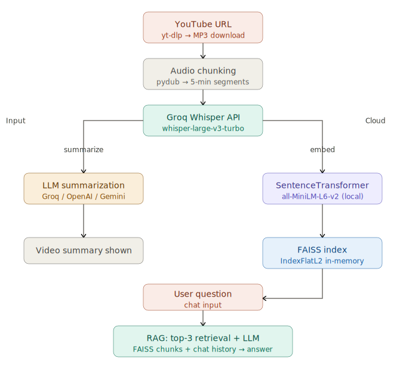

# 🎓 TubeWhiz — AI-Powered YouTube Learning Assistant


> **Ask, Learn, and Explore educational content from any YouTube video — effortlessly.**

TubeWhiz downloads any YouTube video, transcribes it instantly via **Groq Whisper**, summarizes it using your choice of LLM, and lets you chat with the content using a **RAG (Retrieval-Augmented Generation)** pipeline powered by FAISS semantic search.

---

## ✨ Features

- 🎙️ **Instant Transcription** — Groq Whisper API (`whisper-large-v3-turbo`) — near-instant, no GPU needed
- 🤖 **Multi-Provider LLM** — Switch between **Groq** (LLaMA 3.3 70B), **OpenAI** (GPT-4o Mini), or **Gemini** (2.0 Flash) from the sidebar
- 🔍 **Semantic Search** — FAISS + SentenceTransformer embeddings for accurate context retrieval
- 💬 **Conversational Chat** — Ask anything about the video with full chat history awareness
- 📝 **Per-Chunk Summaries** — Detailed summary for every 5-minute segment with live progress bars
- 🧹 **Auto Cleanup** — One-click temp file removal

---

## 🏗️ Architecture


```
YouTube URL
     │
     ▼
 yt-dlp (MP3 download)
     │
     ▼
 pydub (split into 5-min chunks)
     │
     ▼
 Groq Whisper API ──► Transcript chunks
     │
     ├──► Selected LLM (Groq/OpenAI/Gemini) ──► Per-chunk summaries
     │
     ▼
 SentenceTransformer (all-MiniLM-L6-v2)
     │
     ▼
 FAISS IndexFlatL2 (in-memory vector store)
     │
     ▼
 User Query
     │
     ▼
 FAISS top-3 retrieval + chat history
     │
     ▼
 Selected LLM ──► Answer
```

---

## 🛠️ Tech Stack

| Component | Technology |
|---|---|
| Frontend | Streamlit |
| Transcription | Groq Whisper API (`whisper-large-v3-turbo`) |
| LLM (Summarization + Chat) | Groq / OpenAI / Gemini (switchable) |
| Embeddings | SentenceTransformer (`all-MiniLM-L6-v2`) |
| Vector Search | FAISS (`IndexFlatL2`) |
| Audio Download | yt-dlp |
| Audio Processing | pydub + FFmpeg |
| Runtime | Python 3.13 |

---

## ⚡ Quick Setup

### Prerequisites
- Python 3.11+ (3.13 recommended)
- FFmpeg installed and added to PATH ([guide](https://ffmpeg.org/download.html) or `winget install ffmpeg`)
- API keys for at least **Groq** (free) + one of OpenAI / Gemini

### 1. Clone the repository
```bash
git clone https://github.com/yourusername/TubeWhiz.git
cd TubeWhiz
```

### 2. Create and activate virtual environment
```bash
python -m venv .venv

# Windows
.venv\Scripts\activate

# macOS / Linux
source .venv/bin/activate
```

### 3. Install PyTorch (CPU)
```bash
pip install torch==2.6.0+cpu --index-url https://download.pytorch.org/whl/cpu
```
> For NVIDIA GPU: `pip install torch --index-url https://download.pytorch.org/whl/cu121`

### 4. Install remaining dependencies
```bash
pip install -r requirements.txt
```

### 5. Set up environment variables
Create a `.env` file in the root directory:
```env
GROQ_API_KEY=your_groq_key_here         # Required — get free at console.groq.com
OPENAI_API_KEY=your_openai_key_here     # Optional
GOOGLE_API_KEY=your_gemini_key_here     # Optional
```

### 6. Run the app
```bash
streamlit run app.py
```

Open **http://localhost:8501** in your browser.

---

## 🔑 Getting API Keys

| Provider | URL | Free Tier |
|---|---|---|
| Groq | https://console.groq.com | ✅ Generous free tier |
| OpenAI | https://platform.openai.com/api-keys | 💳 Paid (cheap) |
| Gemini | https://aistudio.google.com/apikey | ✅ Free tier |

> **Minimum requirement:** Only `GROQ_API_KEY` is required. Groq handles both transcription and LLM by default.

---

## 🎮 Usage

1. Paste any YouTube URL in the sidebar
2. Select your preferred LLM provider (Groq recommended for speed)
3. Click **🚀 Start Processing**
4. Wait for transcription + summarization (typically 15–40s for a 10-min video)
5. Read the summary, then chat with the video content below

> **Best results with:** lectures, tutorials, talks, podcasts, documentaries. Music videos are not recommended (lyrics ≠ speech).

---

## 📁 Project Structure

```
TubeWhiz/
│
├── app.py                  # Main Streamlit entry point
├── core/
│   ├── downloader.py       # yt-dlp audio download
│   ├── splitter.py         # pydub audio chunking
│   ├── transcriber.py      # Groq Whisper transcription + progress bars
│   ├── summarizer.py       # Provider-agnostic summarization
│   ├── embedder.py         # FAISS index builder
│   └── retriever.py        # Semantic search / chunk retrieval
├── chat/
│   └── chatbot.py          # RAG chat UI — multi-provider
├── utils/
│   ├── model_loader.py     # LLM client loader
│   └── cleanup.py          # Temp file cleanup
├── .env                    # API keys (never commit)
├── requirements.txt
└── README.md
```

---

## 🔧 Troubleshooting

### `ModuleNotFoundError: No module named 'pyaudioop'`
Python 3.13 removed `pyaudioop`. Fix:
```bash
pip install audioop-lts
```

### `OSError: [WinError 1114] DLL initialization failed`
Wrong PyTorch build. Fix:
```bash
pip uninstall torch -y
pip cache purge
pip install torch==2.6.0+cpu --index-url https://download.pytorch.org/whl/cpu
```

### `No module named 'pkg_resources'`
setuptools version issue. Fix:
```bash
pip install setuptools==69.5.1 --force-reinstall
```

### `av` package fails to build
Needs prebuilt binary. Fix:
```bash
pip install av==13.0.0 --only-binary=:all:
```

### `No Python at 'anaconda3\python.exe'`
Broken Anaconda venv. Fix: Install standalone Python from python.org, delete and recreate venv.

### App is slow on transcription
You may be using local Whisper instead of Groq API. Ensure `GROQ_API_KEY` is set in `.env`.

### Groq/Gemini rate limit hit
Switch provider in the sidebar dropdown — the app supports Groq, OpenAI, and Gemini interchangeably.

---

## 🚀 Roadmap

- [ ] Support for video playlists
- [ ] Export chat as PDF
- [ ] Persistent vector store (Pinecone) for multi-session memory
- [ ] Async processing with FastAPI backend
- [ ] Docker containerization
- [ ] Deploy on Streamlit Cloud / HuggingFace Spaces

---

## 📄 License

This project is licensed under the **MIT License** — see below.

```
MIT License

Copyright (c) 2026 Anshul Rathour

Permission is hereby granted, free of charge, to any person obtaining a copy
of this software and associated documentation files (the "Software"), to deal
in the Software without restriction, including without limitation the rights
to use, copy, modify, merge, publish, distribute, sublicense, and/or sell
copies of the Software, and to permit persons to whom the Software is
furnished to do so, subject to the following conditions:

The above copyright notice and this permission notice shall be included in all
copies or substantial portions of the Software.

THE SOFTWARE IS PROVIDED "AS IS", WITHOUT WARRANTY OF ANY KIND, EXPRESS OR
IMPLIED, INCLUDING BUT NOT LIMITED TO THE WARRANTIES OF MERCHANTABILITY,
FITNESS FOR A PARTICULAR PURPOSE AND NONINFRINGEMENT. IN NO EVENT SHALL THE
AUTHORS OR COPYRIGHT HOLDERS BE LIABLE FOR ANY CLAIM, DAMAGES OR OTHER
LIABILITY, WHETHER IN AN ACTION OF CONTRACT, TORT OR OTHERWISE, ARISING FROM,
OUT OF OR IN CONNECTION WITH THE SOFTWARE OR THE USE OR OTHER DEALINGS IN THE
SOFTWARE.
```

---

## 🙋 Author

**Anshul Rathour**  
B.Tech — Chemical and Biochemical Engineering, IIT Patna  
[GitHub](https://github.com/yourusername) • [LinkedIn](https://linkedin.com/in/yourusername)
```